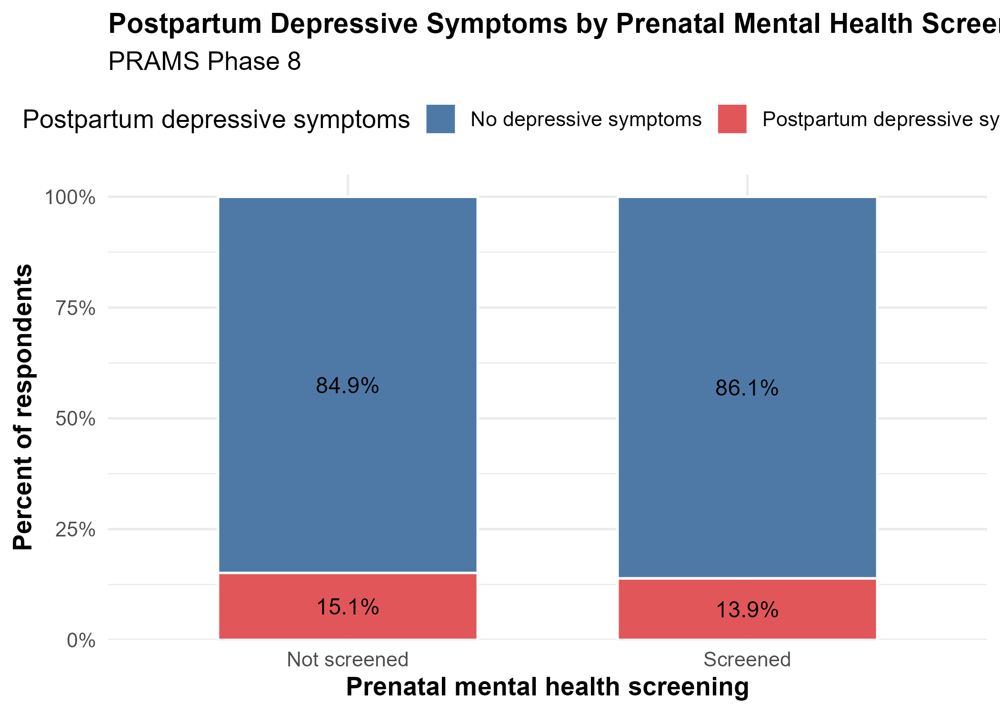

This page presents my semester-long class project for **Modern Applied Data Analysis (MADA)**.  
The project uses PRAMS Phase 8 data to examine prenatal mental health screening and postpartum depressive symptoms.


$\dagger$ Disclaimer: The opinions expressed in this article are the author's own and do not reflect their employer.

# Abstract

This project examines whether prenatal mental health screening is associated with postpartum depressive symptoms using data from the Pregnancy Risk Assessment Monitoring System (PRAMS) Phase 8. The analysis focuses on self reported experiences during prenatal care and postpartum mental health outcomes to assess whether meaningful patterns can be identified in population based surveillance data.

# Introduction

Postpartum depression is a common and serious public health concern that can affect maternal well being, family functioning, and infant outcomes @bauman2020vitalsigns. Clinical guidance increasingly recommends screening for depression and anxiety during pregnancy and the postpartum period @acog2023screening @uspstf2019perinatal. However, it remains unclear whether prenatal mental health screening is associated with postpartum depressive symptoms in real world settings.

Using PRAMS Phase 8 data, this study examines whether individuals who report being asked about depression or anxiety during prenatal care are less likely to report postpartum depressive symptoms. By using a large population based dataset, this project explores whether prenatal screening practices may be associated with postpartum mental health outcomes.

Prenatal and postpartum mental health conditions are increasingly recognized as important components of maternal health @acog2023screening. Poor maternal mental health has been associated with negative consequences for both mothers and infants. Because of this, healthcare providers are encouraged to assess mental health concerns throughout pregnancy and after delivery.

Routine screening during prenatal care may create opportunities to identify individuals who are experiencing symptoms or who may be at increased risk for postpartum depression. Understanding whether prenatal screening is associated with postpartum depressive symptoms may help inform both clinical practice and maternal health policy.

## Description of Data and Data Source

The data for this study come from the Pregnancy Risk Assessment Monitoring System, or PRAMS, Phase 8. PRAMS is a population based surveillance system conducted by the Centers for Disease Control and Prevention in collaboration with state health departments @cdc_prams_phase8_codebook @cdc_prams_phase8_topics. It collects self reported survey data from individuals who recently had a live birth and links those responses to selected birth certificate variables.

PRAMS includes several hundred variables related to maternal demographics, pre pregnancy health conditions, prenatal care experiences, health behaviors, insurance coverage, mental health indicators, and postpartum outcomes. The dataset contains a mix of categorical and numeric variables and reflects real world survey complexity, including skip patterns and missing data.

Across participating states, PRAMS Phase 8 includes a large number of respondents, providing enough sample size and variable richness to support exploratory analysis and regression modeling. For this project, variables related to prenatal mental health screening, prior depression during pregnancy, postpartum depressive symptoms, and selected sociodemographic characteristics were used.

## Research Question

The primary research question for this study is:

Are individuals who report being asked about depression or anxiety during prenatal care less likely to report postpartum depressive symptoms?

The primary outcome of interest is self reported postpartum depressive symptoms, measured using PRAMS survey items assessing depressive symptoms since birth. The primary exposure of interest is prenatal mental health screening, defined as whether a healthcare provider asked about depression or anxiety during prenatal care.

Additional covariates include prior depression during pregnancy, maternal education, and other demographic characteristics considered relevant to postpartum mental health.

# Methods

## Use of Computational Assistance

ChatGPT was used to assist with code troubleshooting and writing support. All code and analytical decisions were reviewed, revised as needed, and implemented by the author. The author takes full responsibility for the accuracy, interpretation, and reproducibility of the work presented here.

## Analysis Approach

The analysis included descriptive summaries of key variables, exploratory comparisons by screening status, and logistic regression modeling to examine the association between prenatal mental health screening and postpartum depressive symptoms while accounting for selected covariates.

## Study Population

The analytic sample included respondents with non missing values for the primary exposure and outcome variables. The final analytic dataset included approximately 237,000 respondents.

## Measures

The primary exposure was self reported prenatal mental health screening, indicating whether a provider asked about depression or anxiety during prenatal care. The primary outcome was postpartum depressive symptoms, coded as a binary indicator. Prior PRAMS based studies have used related postpartum depressive symptom items to examine maternal mental health and provider communication about perinatal depression @bauman2020vitalsigns @farr2016provider @davis2013brief.

Key covariates included prior depression during pregnancy and maternal education. Prior depression during pregnancy was included because it is an important potential confounder in the relationship between prenatal screening and postpartum depressive symptoms.

## Statistical Analysis

Exploratory analyses included descriptive statistics, cross tabulations, and graphical comparisons of postpartum depressive symptoms by screening status. Multivariable logistic regression was used to estimate the association between prenatal mental health screening and postpartum depressive symptoms while adjusting for selected covariates.


# Results

The analytic sample included approximately 237,000 respondents after excluding missing values for the main exposure and outcome. Overall, about 81% of respondents reported being screened for depression during prenatal care, and about 14% reported postpartum depressive symptoms.

Exploratory analyses suggested that postpartum depressive symptoms were more common among respondents who did not report receiving prenatal mental health screening. Higher rates of postpartum depressive symptoms were also observed among respondents who reported depression during pregnancy. Differences across maternal education groups were also examined to explore possible patterns in the data.

Multivariable modeling was conducted to examine whether the association between prenatal mental health screening and postpartum depressive symptoms remained after adjustment for selected covariates.

## Figure

{fig-alt="Proportion of postpartum depressive symptoms by prenatal mental health screening status" fig-cap="Figure 1. Proportion of postpartum depressive symptoms by prenatal mental health screening status."}

## Table

```{r}
# Load core packages used across the project
library(here)
library(knitr)
library(readr)
library(dplyr)

analytic_dat <- readRDS(
  "C:/Users/alexa/OneDrive/Documents/GitHub/TejadaStrop-MADA-project/data/processed-data/prams_analytic.rds"
)

analytic_dat |>
  count(screened, pp_depress_bin) |>
  group_by(screened) |>
  mutate(percent = round(n / sum(n) * 100, 1)) |>
  mutate(
    screening = ifelse(screened == 1, "Screened", "Not screened"),
    outcome = ifelse(pp_depress_bin == 1, "Yes", "No")
  ) |>
  select(`Prenatal screening` = screening,
         `Postpartum depressive symptoms` = outcome,
         n,
         `Percent within screening group` = percent)


tbl <- read_csv("tables/screening_summary.csv", show_col_types = FALSE)
kable(tbl, caption = "Table 1. Prenatal screening and postpartum depressive symptoms")

model_tbl <- read_csv("tables/model_comparison.csv", show_col_types = FALSE)
```

## Model validation

```{r}
library(readr)
library(knitr)

model_tbl <- read_csv("tables/model_comparison.csv", show_col_types = FALSE)

kable(
  model_tbl,
  caption = "Table 2. Cross validation model comparison"
)
```

Interpretation of model comparison

Model validation using 5 fold cross validation compared logistic regression and random forest models. This step helped assess whether a more flexible model improved prediction of postpartum depressive symptoms.

After adjusting for prior depression during pregnancy and maternal education, prenatal mental health screening was associated with lower odds of postpartum depressive symptoms. Prior depression during pregnancy was the strongest predictor of postpartum depressive symptoms. These findings highlight the importance of screening and early identification of maternal mental health concerns.

## Model performance comparison

```{r}
library(tidyverse)
library(readr)

model_compare <- read_csv("tables/model_comparison.csv", show_col_types = FALSE)

auc_plot <- model_compare |>
  filter(.metric == "roc_auc") |>
  ggplot(aes(x = model, y = mean, fill = model)) +
  geom_col(width = 0.6) +
  labs(
    title = "Model Performance Comparison",
    y = "ROC-AUC",
    x = ""
  ) +
  theme_minimal() +
  theme(legend.position = "none")

auc_plot
```


```{r}
reg <- read_csv("tables/regression_results.csv", show_col_types = FALSE)
kable(reg, caption = "Table 2. Multivariable logistic regression results")
```

After adjusting for prior depression during pregnancy and maternal education, prenatal mental health screening was associated with lower odds of postpartum depressive symptoms. Prior depression during pregnancy remained the strongest predictor of postpartum depressive symptoms in the model. These results suggest that screening during prenatal care may help identify individuals who are at higher risk of postpartum depression.


# Discussion

This study examined whether self reported prenatal mental health screening was associated with postpartum depressive symptoms using PRAMS Phase 8 data. Exploratory analyses suggested that postpartum depressive symptoms were more commonly reported among individuals who did not report receiving prenatal mental health screening. Prior depression during pregnancy was also strongly associated with postpartum depressive symptoms, highlighting the importance of mental health history when examining postpartum outcomes.

These findings support continued attention to maternal mental health within prenatal care. Screening may help identify individuals who need additional evaluation or support, although the results should be interpreted cautiously. Because the data are observational and self reported, this analysis cannot determine whether screening itself reduces postpartum depressive symptoms.

This project has several strengths, including the use of a large population based dataset and the ability to examine prenatal care experiences and postpartum mental health outcomes in the same analytic framework. At the same time, the study has important limitations. PRAMS data are self reported and may be subject to recall bias or reporting bias. In addition, the postpartum depressive symptom measure reflects survey reported symptoms rather than a clinical diagnosis @davis2013brief. Unmeasured factors such as healthcare access, provider practices, and social support may also influence the observed associations.

Overall, this study shows how PRAMS data can be used to examine maternal mental health patterns and generate questions for future research. Continued attention to prenatal screening and postpartum mental health remains important for improving maternal and infant health outcomes @bauman2020vitalsigns @stone2015stressful.

## Limitations

This analysis has several limitations. PRAMS data are self-reported and may be subject to recall bias or reporting bias. In addition, the postpartum depressive symptom measure reflects survey-reported symptoms rather than a clinical diagnosis. Because the data are observational and cross-sectional, the analysis cannot establish a causal relationship between prenatal screening and postpartum depressive symptoms. Unmeasured factors such as healthcare access, provider practices, and social support may also influence the observed associations.

# Project Repository

The full project repository is available here:

[TejadaStrop-MADA-project](https://github.com/alex8528/TejadaStrop-MADA-project)

# References